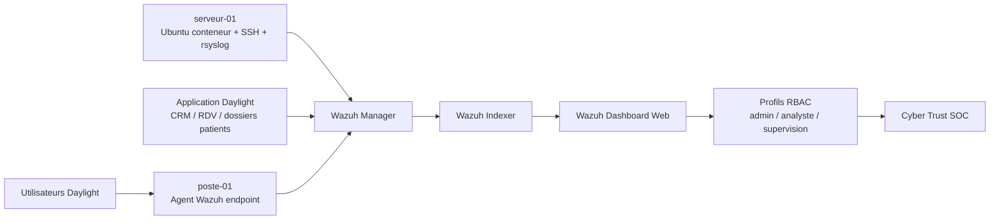
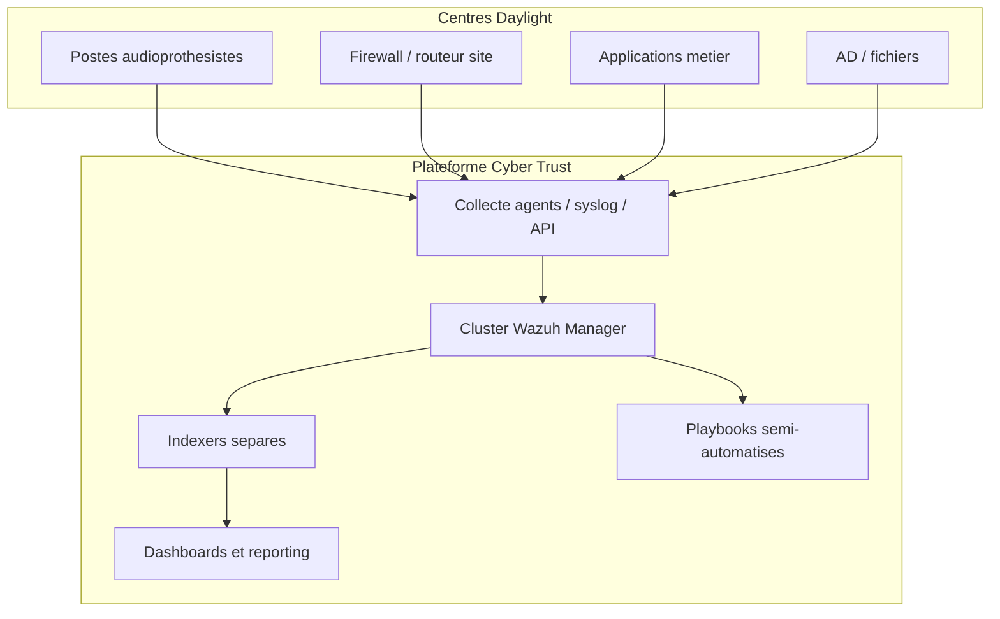

# Rapport technique groupe - Projet 4 Daylight / Cyber Trust

## Page de garde

**Projet :** Mise en place d'un SOC externalise pour Daylight  
**Client fictif :** Daylight, reseau de centres d'audioprothesistes  
**Prestataire :** Cyber Trust  
**Equipe :** Yvan FOCSA, Youssef GUERNIOU, Kilyan FELIX, Mahamadou DIACOUMBA  
**Formation :** Mastere Cybersecurite - Projet d'etude 2025-2026  
**Livrable :** Rapport technique complet

## 1. Presentation de l'entreprise cliente

Daylight est un reseau national d'environ trente centres d'audioprothesistes. Les utilisateurs metier manipulent des rendez-vous, des informations CRM, des dossiers patients et des donnees administratives. Le SI est distribue sur plusieurs sites et s'appuie sur des postes de travail, des serveurs internes, des applications metier, de la messagerie et des equipements reseau.

Les risques principaux sont lies a la sensibilite des donnees patients, a la dispersion des sites et au manque de ressources internes dediees a la surveillance de securite. Daylight souhaite donc externaliser la supervision cyber a Cyber Trust via un SOC capable de collecter, correler, qualifier et restituer les alertes de securite.

## 2. Presentation de Cyber Trust et de l'equipe projet

Cyber Trust agit comme prestataire SOC externalise. L'objectif n'est pas seulement de livrer un outil, mais de fournir une solution exploitable par un client : architecture comprehensible, deploiement reproductible, procedures de reponse, documentation et capacite de demonstration.

| Membre | Role | Responsabilites |
|---|---|---|
| Yvan FOCSA | Architecte de la solution | Conception d'architecture, choix techniques, securisation, trajectoire cible, couts, coherence du dossier. |
| Youssef GUERNIOU | Ingenieur SIEM / Wazuh | Deploiement Wazuh, collecte, integration des sources, RBAC, dashboards et automatisation du lab. |
| Kilyan FELIX | Chef de projet SOC / lead detection | Planning, backlog, qualification des alertes, matrice de criticite, reporting, coordination de la demo. |
| Mahamadou DIACOUMBA | Exploitation, VM, playbooks, REX | Environnement de demonstration, procedures d'exploitation, playbooks, REX d'incidents et maintien en conditions operationnelles. |

## 3. Analyse de la problematique

Daylight doit surveiller un SI multi-site sans disposer d'une equipe SOC interne. Le cahier des charges demande un demonstrateur operationnel, mais aussi une solution industrialisable dans un modele d'infogerance. Cela impose de couvrir trois niveaux :

- **Technique :** collecter les evenements depuis des sources heterogenes et les centraliser dans un SIEM open-source.
- **Operationnel :** qualifier les alertes, definir des procedures et rendre les dashboards lisibles par role.
- **Client :** produire une restitution claire, documentee et reproductible, utilisable pendant une demonstration professionnelle.

### Surfaces d'attaque retenues

| Brique SI | Risques principaux | Evenements a surveiller |
|---|---|---|
| Postes de travail | Malware, execution suspecte, USB non autorise, compromission utilisateur | Authentifications locales, processus, usage USB, controle de conformite. |
| Serveurs internes | Brute force, elevation de privileges, acces aux partages | Authentification SSH/Windows, modifications de droits, acces fichiers. |
| Applications metier | Acces anormal aux dossiers patients, brute force, erreurs applicatives | Logs CRM/RDV/dossiers patients, erreurs, acces hors profil. |
| Messagerie | Phishing, pieces jointes malveillantes, vol d'identifiants | Signalements, logs passerelle mail, connexions suspectes. |
| Routeurs / firewalls | Mauvaise configuration, flux non autorises, scan | Flux reseau, refus, modifications de configuration. |

## 4. Solution proposee

Cyber Trust propose un SOC externalise base sur Wazuh. La version de demonstration est deployee en single-node Docker afin d'etre reproductible et exploitable rapidement. La trajectoire cible conserve la meme logique fonctionnelle, mais separe les composants pour supporter plusieurs sites et davantage de volumetrie.

### Architecture de demonstration

### Architecture cible industrialisable

La separation cible permet d'ameliorer la disponibilite, la performance et la maintenabilite. Pour une trentaine de sites, Cyber Trust recommande une phase pilote sur quelques centres avant generalisation.

## 5. Outils et composants

| Composant | Choix | Justification |
|---|---|---|
| SIEM | Wazuh 4.14.5 | Open-source, agents multiplateformes, dashboard web, regles, SCA, alertes. |
| Deploiement demo | Docker single-node | Reproductible, rapide a relancer, adapte a une soutenance. |
| Source endpoint | Agent Wazuh Windows `poste-01` | Surveillance poste, audit CIS Windows 11, evenements endpoint. |
| Source serveur | Conteneur Ubuntu `serveur-01` | Simulation serveur interne, SSH, rsyslog, auth.log. |
| Source metier | Logs Daylight | Demonstration des alertes propres au client : acces dossier patient, CRM, RDV. |
| Firewall / routeur | pfSense | Segmentation VLAN, regles firewall, NAT, logs `filterlog` envoyes a Wazuh. |
| Acces | RBAC Wazuh | Segmentation supervision / analyste / admin. |
| Procedures | Playbooks Cyber Trust | Qualification et reponse coherentes aux incidents. |

## 6. Detections et alertes

La detection repose sur les regles natives Wazuh et sur des regles adaptees aux evenements Daylight.

| Regle / scenario | Source | Severite | Objectif |
|---|---|---:|---|
| `5712` - brute force SSH | `serveur-01` | Haute | Detecter des tentatives repetees d'authentification serveur. |
| `100110` - brute force applicatif | Daylight | Haute | Identifier une attaque sur l'interface metier. |
| `100120` - acces anormal dossier patient | Daylight | Critique | Detecter un acces suspect a des donnees sensibles. |
| `100130` - modification groupe privilegie | Daylight / annuaire | Critique | Reperer une elevation de privileges. |
| `100140` - usage USB suspect | Endpoint | Moyenne a haute | Controler les supports amovibles sur poste. |
| `110010` - flux WAN bloque | pfSense | Haute | Detecter scan ou tentative entrante bloquee par le firewall. |
| `110020` - tentative inter-VLAN | pfSense | Critique | Reperer un mouvement lateral vers serveurs, SOC ou administration. |
| SCA CIS Windows 11 | `poste-01` | Variable | Evaluer la posture de durcissement endpoint. |

## 7. Dashboards et reporting

Deux niveaux de dashboard sont retenus :

- **Dashboard technique :** alertes par severite, par source, top regles declenchees, vue detaillee pour analystes.
- **Dashboard executif :** volume global, alertes critiques, repartition par site, tendance et indicateurs lisibles pour supervision.

Les preuves existantes dans `Youssef GUERNIOU/Documentation_SIEM_Youssef_GUERNIOU.pdf` mentionnent un dashboard technique consolide et un dashboard executif avec 216 alertes dont 4 critiques. Ces elements doivent etre montres dans la video et accompagnes de captures dans le PDF final.

## 8. Interface et RBAC

L'interface est web-based via Wazuh Dashboard. Trois profils sont prevus :

| Profil | Droits | Usage |
|---|---|---|
| Admin | Acces complet | Administration de la plateforme, configuration, securite. |
| Analyste | Lecture des alertes et dashboards | Qualification, analyse, escalade. |
| Supervision | Lecture orientee pilotage | Suivi des indicateurs et reporting client. |

La documentation SIEM indique que les comptes `analyste` et `supervision` sont rattaches au role `soc_readonly`, avec restriction sur les pages d'administration.

## 9. Gestion des couts

Le choix open-source limite les couts de licences sur la phase de demonstration. Les couts se concentrent sur l'infrastructure, l'exploitation et l'accompagnement.

| Poste | Demonstrateur | Industrialisation |
|---|---:|---:|
| Licences SIEM | 0 euro logiciel Wazuh | 0 euro logiciel Wazuh, cout support optionnel |
| Infrastructure | 1 poste Docker / VM locale | VM ou serveurs separes manager, indexer, dashboard |
| Stockage logs | Faible, volume de demo | Dimensionnement selon retention et volumetrie par site |
| Exploitation | Equipe projet | Astreinte, analystes, supervision, maintenance |
| Formation | Preparation soutenance | Formation utilisateurs Daylight et runbooks |

Recommandation : conserver Wazuh pour le pilote, puis chiffrer la production selon la retention voulue, le nombre d'endpoints, la frequence de reporting et le niveau de service Cyber Trust.

## 10. Organisation et methodologie

L'equipe suit une methode hybride : cadrage initial, backlog de livrables, iterations techniques courtes, puis consolidation documentaire et demonstration.

| Phase | Objectif | Responsable |
|---|---|---|
| Cadrage | Comprendre Daylight, exigences, risques et livrables | Kilyan + Yvan |
| Architecture | Definir solution demo et cible | Yvan |
| Deploiement SIEM | Installer Wazuh, agents et collecte | Youssef |
| Detection | Qualifier les scenarios et severites | Kilyan + Youssef |
| Exploitation | Procedures, VM, playbooks, redemarrage | Mahamadou |
| Consolidation | Rapport, video, preuves, REX | Tous |

## 11. Plan de deploiement

1. Installer les prerequis : Docker Desktop, npm si le lab Daylight est disponible, acces administrateur local.
2. Demarrer le lab Wazuh.
3. Raccorder les sources : poste endpoint, serveur Linux simule, logs Daylight.
4. Verifier la remontee des evenements dans Wazuh.
5. Declencher les scenarios de test.
6. Controler les dashboards et les profils RBAC.
7. Capturer les preuves et derouler les playbooks.
8. Produire la restitution client.

## 12. Tests de securite et validation

| Test | Attendu | Preuve a capturer |
|---|---|---|
| Brute force SSH sur `serveur-01` | Alerte `5712` niveau haut | Capture alerte Wazuh + extrait `auth.log`. |
| Acces anormal dossier patient | Alerte `100120` | Capture dashboard Daylight + fiche incident. |
| Brute force applicatif | Alerte `100110` | Capture top regles / detail alerte. |
| Modification groupe privilegie | Alerte `100130` | Capture evenement + qualification critique. |
| Usage USB suspect | Alerte `100140` ou evenement endpoint | Capture endpoint / regle. |
| RBAC analyste | Administration bloquee | Capture acces refuse. |
| Dashboard executif | Indicateurs visibles | Capture KPI alertes totales / critiques / sites. |

## 13. Procedures et playbooks

Les procedures detaillees sont centralisees dans `03_PLAYBOOKS_PROCEDURES_REX.md`. Elles couvrent :

- triage initial ;
- brute force SSH ;
- acces anormal aux dossiers patients ;
- brute force applicatif ;
- modification de groupe privilegie ;
- usage USB suspect ;
- phishing / messagerie ;
- redemarrage du lab ;
- fiche REX post-incident.

## 14. Limites rencontrees

Le demonstrateur est volontairement simplifie. Le mode single-node Docker est adapte a la soutenance, mais ne constitue pas une architecture de production haute disponibilite. La collecte firewall, messagerie et Active Directory est concretisee par des configurations pfSense/Wazuh et des logs de demonstration, puis devra etre raccordee a des equipements reels lors d'une phase suivante. Les preuves existantes sont concentrees dans le perimetre SIEM de Youssef ; les autres contributions doivent etre valorisees par les documents, la video et les captures finales.

## 15. Perspectives d'evolution

1. Passer d'un Wazuh single-node a une architecture clusterisee.
2. Ajouter une collecte firewall/syslog et messagerie.
3. Integrer un annuaire Active Directory de demonstration.
4. Ajouter des tableaux de bord par centre Daylight.
5. Industrialiser les templates de deploiement agent.
6. Automatiser une partie des reponses via scripts controles.
7. Formaliser un SLA Cyber Trust : delais de qualification, escalade et reporting mensuel.

## 16. Conclusion

La solution Cyber Trust repond aux attentes principales : centralisation des evenements, SIEM open-source, interface web, segmentation des roles, detection de scenarios pertinents pour Daylight, dashboards et procedures de reponse. Le demonstrateur existant fournit deja une base SIEM concrete grace au travail de Youssef. Les documents ajoutes structurent l'ensemble du projet afin d'obtenir un rendu groupe coherent, professionnel et conforme aux consignes pedagogiques.
