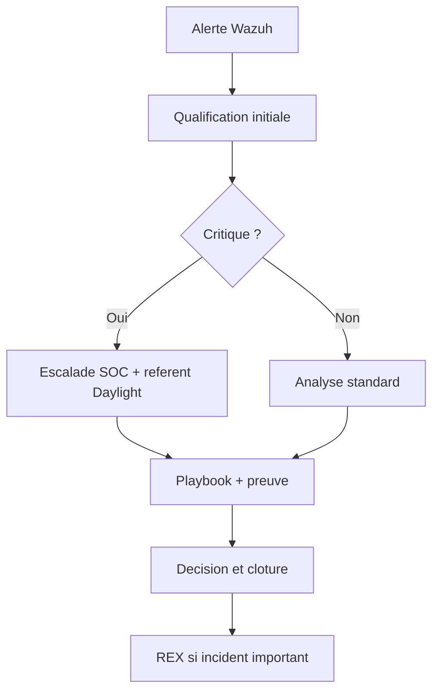

# Rendu individuel developpe - Kilyan FELIX

## Identification

| Champ | Valeur |
|---|---|
| Projet | Projet 4 - SOC externalise Daylight |
| Client fictif | Daylight |
| Prestataire | Cyber Trust |
| Membre | Kilyan FELIX |
| Role principal | Chef de projet SOC, lead detection, alertes, dashboards et qualification |
| Perimetre defendu | Pilotage projet, backlog, criteres d'acceptation, matrice de criticite, dashboards, qualification et preparation video |

## Synthese personnelle

Mon role est de rendre le projet pilotable et exploitable. Un SIEM peut generer beaucoup d'evenements, mais un client comme Daylight a besoin de savoir ce qui est important, qui agit, dans quel delai et avec quelle preuve.

J'ai donc structure ma contribution autour de cinq axes :

- organiser le projet et les roles de l'equipe Cyber Trust ;
- definir les scenarios de detection utiles a Daylight ;
- transformer les alertes en priorites operationnelles ;
- concevoir les dashboards technique et executif ;
- preparer le deroule de soutenance/video pour prouver le MVP.

Ma partie fait le lien entre la technique et la decision. Elle repond a la question : "qu'est-ce que Daylight peut faire concretement avec les alertes ?"

## Contexte projet et enjeux de pilotage

Daylight est un client multi-site avec des donnees sensibles. L'entreprise n'a pas vocation a lire des logs bruts tous les jours. Elle attend de Cyber Trust :

- une vision claire des alertes importantes ;
- une priorisation ;
- des dashboards lisibles ;
- des procedures de reponse ;
- un reporting qui permet de piloter le service.

Le role de chef de projet SOC consiste donc a eviter deux risques :

1. produire un dossier trop technique que le client ne comprend pas ;
2. produire une demo jolie mais sans logique operationnelle.

Mon travail consiste a relier les exigences, les livrables, les preuves et le discours.

## Organisation de l'equipe Cyber Trust

| Membre | Role retenu | Contribution principale |
|---|---|---|
| Yvan FOCSA | Architecte solution | Architecture, segmentation, pfSense, flux, trajectoire cible |
| Youssef GUERNIOU | Ingenieur SIEM Wazuh | Deploiement, agents, regles, dashboards Wazuh, RBAC |
| Kilyan FELIX | Chef de projet SOC | Detection, qualification, dashboards, planning, video |
| Mahamadou DIACOUMBA | Exploitation lab / playbooks / REX | VM, relance lab, procedures, playbooks, REX incidents |

Cette repartition permet de couvrir les attentes du cahier des charges : technique, organisation, preuves, video et contributions individuelles.

## Methode de pilotage

La methode retenue est hybride :

- cadrage initial a partir du cahier des charges ;
- backlog de livrables ;
- construction technique par lots ;
- validation par preuves ;
- consolidation finale en PDF/ZIP ;
- preparation de la video.

Les livrables projet qui supportent mon pilotage sont :

- `05_BACKLOG_PLANNING.md`
- `11_CHECKLIST_DEPOT_FINAL.md`
- `13_PLAN_RECETTE_ACCEPTATION.md`
- `19_ROLES_CONTRIBUTIONS_PREUVES.md`
- `21_DASHBOARDS_ALERTES_QUALIFICATION.md`
- `23_PREUVES_FINALES_CAPTURES_VIDEO_DEPOT.md`
- `30_TABLEAU_BORD_STATUT_FINAL.md`
- `31_PACK_SOUTENANCE_JURY.md`
- `33_RUNBOOK_ENREGISTREMENT_VIDEO_IMMEDIAT.md`

## Backlog simplifie

| ID | Lot | Responsable | Statut | Preuve |
|---|---|---|---|---|
| B-001 | Lire cahier des charges | Tous | Fait | Registre exigences |
| B-002 | Definir architecture | Yvan | Fait | CAP-12, config pfSense |
| B-003 | Deployer Wazuh | Youssef | Fait | CAP-01, CAP-02 |
| B-004 | Integrer alertes | Youssef/Kilyan | Fait | CAP-03, CAP-05 |
| B-005 | Formaliser dashboards | Kilyan | Fait | CAP-07, CAP-08, CAP-21, CAP-22 |
| B-006 | Rediger playbooks | Mahamadou | Fait | CAP-10, CAP-11 |
| B-007 | Preparer video | Kilyan + tous | Pret hors enregistrement | Teleprompteur, overlays |
| B-008 | Generer rendu 5 PDF | Tous | Fait | `Rendu_Simple_5PDF/` |

## Scenarios de detection priorises

Le projet doit montrer des scenarios qui ont du sens pour Daylight, pas seulement des alertes generiques.

| Scenario | Regle | Criticite | Pourquoi c'est important |
|---|---|---:|---|
| Acces anormal dossier patient | `100120` | Critique | Donnees sensibles, risque RGPD, impact client |
| Modification groupe privilegie | `100130` | Critique | Risque d'elevation de privileges |
| Mouvement lateral inter-VLAN | `110020` | Critique | Tentative de contournement segmentation |
| Brute force SSH | `5712` | Haute | Compromission serveur possible |
| Brute force applicatif | `100110` | Haute | Attaque interface metier |
| Phishing signale | `100150` | Haute | Risque identifiants et propagation |
| USB non autorise | `100140` | Moyenne/Haute | Risque endpoint et fuite de donnees |
| Scan WAN bloque | `110010` | Moyenne | Bruit reseau a surveiller |

## Matrice de criticite SOC

La criticite est definie selon l'impact metier et l'urgence de reponse.

| Niveau | Delai triage | Criteres | Exemple | Decision |
|---|---|---|---|---|
| Critique | 15 min | Donnees patients, privilege, lateral movement, exfiltration | `100120`, `100130`, `110020`, `110050` | Escalade immediate |
| Haute | 30 min | Attaque active ou compromission possible | `5712`, `100110`, `100150` | Qualification prioritaire |
| Moyenne | 4 h | Suspicion a contextualiser | `100140`, `110010` | Analyse et suivi |
| Basse | J+1 | Hygiene ou information | Controles standards | Amelioration continue |

La matrice est formalisee dans :

`config/wazuh/daylight_alert_qualification_matrix.csv`

## Workflow de qualification

Le workflow SOC doit etre simple et repetable :

1. une alerte arrive dans Wazuh ;
2. l'analyste lit la regle, la source et le niveau ;
3. il identifie le contexte : utilisateur, poste, serveur, site, application ;
4. il verifie les preuves associees ;
5. il applique le playbook ;
6. il decide : faux positif, incident confirme, surveillance, escalade ;
7. il documente l'action et les preuves ;
8. un REX est produit pour les incidents critiques.

## Fiche de qualification type

| Champ | Exemple attendu |
|---|---|
| ID alerte | `100120` |
| Titre | Acces anormal a un dossier patient |
| Source | Application Daylight |
| Utilisateur | Compte ayant realise l'action |
| Site | Centre Daylight concerne |
| Impact | Donnees patients, risque RGPD |
| Preuves | Capture Wazuh, log applicatif, horodatage |
| Decision | Incident confirme / faux positif / surveillance |
| Action | Escalade DPO, suspension session, verification metier |
| REX | Cause, correction, prevention |

## Dashboards : logique de conception

Le projet distingue deux publics.

Le dashboard technique est concu pour les analystes SOC. Il doit aider a investiguer rapidement :

- top regles ;
- severite ;
- timeline ;
- sources ;
- evenements Daylight ;
- evenements pfSense.

Le dashboard executif est concu pour Daylight. Il doit aider a piloter le service :

- total alertes ;
- alertes critiques ;
- alertes donnees patients ;
- tentatives reseau bloquees ;
- tendance 24h ;
- priorites du moment.

## Requetes de dashboards

Les widgets sont formalises dans :

`config/wazuh/daylight_dashboard_queries.csv`

Extraits :

| Dashboard | Widget | Requete | Objectif |
|---|---|---|---|
| Technique SOC | Alertes par severite | `rule.level >= 7` | Prioriser |
| Technique SOC | Top regles | `rule.id:*` | Identifier le bruit |
| Technique SOC | Evenements Daylight | `rule.id:(100110 OR 100120 OR 100130 OR 100140 OR 100150)` | Suivre metier |
| Executif Daylight | Alertes critiques | `rule.level >= 12` | Piloter risque |
| Executif Daylight | Alertes patients | `rule.id:100120` | Suivre donnees sensibles |
| Firewall Daylight | Mouvement inter-VLAN | `rule.id:110020` | Suivre segmentation |

Cette formalisation permet de reconstruire les dashboards et de justifier leur utilite.

## KPI proposes pour Cyber Trust

Pour passer d'une demo a un service SOC, Cyber Trust doit suivre des indicateurs.

| KPI | Definition | Utilite |
|---|---|---|
| Nombre d'alertes critiques | Alertes niveau >= 12 | Mesurer le risque fort |
| Temps moyen de triage | Delai entre alerte et premiere decision | Mesurer efficacite SOC |
| Taux de faux positifs | Alertes fermees sans incident | Ameliorer regles |
| Incidents par site | Incidents confirmes par centre | Identifier sites a risque |
| Sources muettes | Agents ou logs absents | Controler couverture |
| Playbooks executes | Nombre d'incidents traites avec procedure | Verifier maturite |
| REX produits | REX apres incidents critiques | Amelioration continue |

## Plan de recette rattache a mon perimetre

| Test | Objectif | Responsable | Resultat attendu |
|---|---|---|---|
| REC-DET-01 | Alerte `5712` visible | Youssef/Kilyan | Brute force SSH qualifiable |
| REC-DET-02 | Alerte `100120` visible | Youssef/Kilyan | Incident patient critique |
| REC-DET-03 | Alerte `110020` visible | Yvan/Kilyan | Mouvement lateral bloque |
| REC-DASH-01 | Dashboard technique lisible | Kilyan | Analyse rapide possible |
| REC-DASH-02 | Dashboard executif lisible | Kilyan | Vue client synthetique |
| REC-PB-01 | Playbook rattache | Mahamadou/Kilyan | Action concrete documentee |
| REC-VIDEO-01 | Chaque membre parle | Kilyan | Preuve de contribution individuelle |

## Preparation de la video

Le cadre pedagogique demande une video de demonstration avec contribution de chaque membre. J'ai donc rattache la video a des supports concrets :

- `04_SCRIPT_VIDEO_DEMO.md`
- `09_NOTES_ORATEUR_SOUTENANCE.md`
- `26_MODE_OPERATOIRE_VIDEO_DEPOT.md`
- `33_RUNBOOK_ENREGISTREMENT_VIDEO_IMMEDIAT.md`
- `Dashboards_Offline/daylight_video_teleprompter.html`
- `Dashboards_Offline/daylight_video_recording_pack.html`
- `Video_Overlays/`

Les overlays affichent le nom et le role de chaque intervenant. Cela evite que la video soit percue comme une presentation anonyme.

## Deroule video propose

| Minute | Intervenant | Contenu | Preuve ecran |
|---|---|---|---|
| 00:00-01:30 | Kilyan | Contexte Daylight, objectif SOC, roles | Presentation |
| 01:30-04:00 | Yvan | Architecture, pfSense, segmentation | CAP-12, CAP-13 |
| 04:00-08:30 | Youssef | Wazuh, agents, alertes | CAP-01 a CAP-05 |
| 08:30-11:30 | Kilyan | Dashboards, criticite, qualification | CAP-07, CAP-08, CAP-23 |
| 11:30-14:30 | Mahamadou | Playbooks, REX, exploitation lab | CAP-10, CAP-11, CAP-25 |
| 14:30-17:00 | Equipe | Limites, industrialisation, depot | ZIP, hash, manifeste |

## Risques projet et reponses

| Risque | Impact | Reponse |
|---|---|---|
| Wazuh indisponible pendant video | Demo bloquee | Captures, dashboard offline, preflight |
| Trop d'alertes non expliquees | Jury perdu | Matrice criticite et scenarios prioritaires |
| PDF trop disperses | Depot confus | Rendu simplifie 5 PDF |
| Partie individuelle trop courte | Contribution mal valorisee | PDF perso developpes |
| Lien video absent | Depot incomplet | Fichier lien pret et runbook import |
| pfSense percu comme abstrait | Manque de concret | CSV regles, captures, syslog, Wazuh rules |

## Livrables rattaches a mon perimetre

| Livrable | Usage |
|---|---|
| `05_BACKLOG_PLANNING.md` | Organisation projet |
| `13_PLAN_RECETTE_ACCEPTATION.md` | Validation fonctionnelle |
| `21_DASHBOARDS_ALERTES_QUALIFICATION.md` | Detection, dashboards et triage |
| `24_DASHBOARD_SOC_OFFLINE.md` | Support de secours |
| `31_PACK_SOUTENANCE_JURY.md` | Reponses jury |
| `33_RUNBOOK_ENREGISTREMENT_VIDEO_IMMEDIAT.md` | Tournage video |
| `config/wazuh/daylight_dashboard_queries.csv` | Requetes dashboards |
| `config/wazuh/daylight_alert_qualification_matrix.csv` | SLA et qualification |
| `Dashboards_Offline/daylight_soc_dashboard.html` | Dashboard offline montrable |

## Ce que je dois montrer pendant la soutenance

Mon passage doit prouver que les alertes sont exploitables :

1. ouvrir le dashboard technique ;
2. montrer les alertes par severite ;
3. expliquer pourquoi `100120` est critique ;
4. ouvrir la fiche de qualification ou la matrice ;
5. montrer la difference entre dashboard technique et executif ;
6. rappeler le SLA de triage ;
7. expliquer comment l'alerte passe vers un playbook et un REX.

Texte court possible :

> Je suis Kilyan FELIX, chef de projet SOC et lead detection. Mon role est de transformer les alertes Wazuh en decisions exploitables : criticite, SLA, dashboard, qualification et deroule de demonstration.

## Limites assumees

La partie detection/qualification reste un MVP :

- pas d'outil ITSM connecte ;
- pas de vrai SOAR ;
- les SLA sont proposes mais pas mesures sur une production reelle ;
- les dashboards sont valides sur un volume limite ;
- la video finale doit encore etre enregistree et publiee.

Ces limites sont normales pour le projet. La valeur ajoutee est de montrer un workflow clair et pret a etre industrialise.

## Apport personnel

Ce projet m'a montre qu'un SOC n'est pas uniquement une collection d'outils. Il faut une logique de pilotage : prioriser, expliquer, coordonner, verifier et rendre compte.

J'ai particulierement travaille sur :

- la traduction des alertes en criticite metier ;
- la difference entre une vue analyste et une vue client ;
- la preparation d'une demonstration fluide ;
- la coherence entre les preuves et le discours.

## Conclusion individuelle

Ma contribution donne au projet sa lisibilite operationnelle. Elle montre comment Cyber Trust peut presenter a Daylight un SOC utilisable : alertes priorisees, dashboards adaptes, SLA, qualification, playbooks et reporting.

Le resultat attendu est que le jury comprenne non seulement que la solution detecte des evenements, mais aussi que l'equipe sait quoi en faire.
