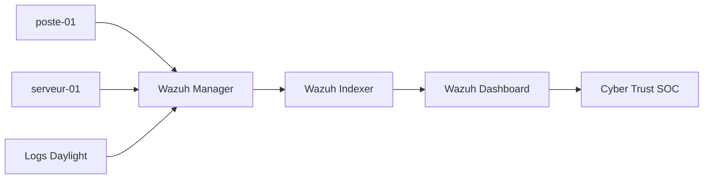

# Support de presentation - Projet Daylight / Cyber Trust

## Objectif

Ce support sert de trame pour les slides de soutenance et pour la video. Il reprend les exigences du cahier des charges : presentation client, equipe, besoin, solution, organisation, demonstration technique, dashboards, playbooks, limites et evolution.

## Slide 1 - Titre

**Mise en place d'un SOC externalise pour Daylight**  
Cyber Trust - Projet 4 - Mastere Cybersecurite

Intervenant : Kilyan FELIX

Message cle :
Cyber Trust presente un demonstrateur SOC pour Daylight, reseau d'audioprothesistes multi-site, avec SIEM, alertes, dashboards, RBAC et procedures.

## Slide 2 - Contexte Daylight

Contenu :

- environ trente centres d'audioprothesistes ;
- donnees sensibles : rendez-vous, CRM, dossiers patients ;
- SI distribue : postes, serveurs, applications, messagerie, firewall ;
- besoin d'un SOC externalise faute de ressources internes.

Intervenant : Kilyan FELIX

Message cle :
Le probleme n'est pas seulement technique : Daylight doit obtenir de la visibilite et une capacite de reaction exploitable.

## Slide 3 - Objectifs du projet

Contenu :

- centraliser les evenements de securite ;
- deployer un SIEM open-source ;
- creer un environnement de demonstration operationnel ;
- produire des dashboards lisibles ;
- formaliser des playbooks et un guide de deploiement ;
- rendre la solution industrialisable.

Intervenant : Kilyan FELIX

## Slide 4 - Equipe Cyber Trust

| Membre | Role |
|---|---|
| Yvan FOCSA | Architecte de la solution |
| Youssef GUERNIOU | Ingenieur SIEM / Wazuh |
| Kilyan FELIX | Chef de projet SOC et lead detection |
| Mahamadou DIACOUMBA | Exploitation, VM, playbooks et REX |

Intervenant : Kilyan FELIX

Message cle :
La repartition couvre architecture, SIEM, detection, exploitation et documentation.

## Slide 5 - Architecture du demonstrateur

Contenu :

- Wazuh Manager, Indexer et Dashboard en single-node Docker ;
- source endpoint `poste-01` ;
- source serveur `serveur-01` ;
- source applicative Daylight ;
- interface web Wazuh Dashboard.

Intervenant : Yvan FOCSA

## Slide 6 - Architecture cible industrialisable

Contenu :

- collecte multi-site agents, syslog et API ;
- separation manager, indexer et dashboard ;
- retention logs dimensionnee ;
- dashboards par role ;
- playbooks et reporting client.

Intervenant : Yvan FOCSA

Message cle :
Le lab prouve le fonctionnement ; l'architecture cible rend la solution exploitable a l'echelle des centres Daylight.

## Slide 7 - Demonstration SIEM

Contenu a montrer :

- connexion Wazuh ;
- agents actifs ;
- sources `poste-01`, `serveur-01`, Daylight ;
- alerte brute force SSH `5712` ;
- alertes metier `100110`, `100120`, `100130`, `100140`.

Intervenant : Youssef GUERNIOU

Message cle :
Le SIEM centralise des evenements heterogenes et detecte des scenarios pertinents pour Daylight.

## Slide 8 - Dashboards

Contenu :

- dashboard technique : severite, source, top regles ;
- dashboard executif : volume total, critiques, repartition par site ;
- lecture differente pour analyste et supervision.

Intervenant : Kilyan FELIX

Message cle :
Les dashboards transforment les logs en information exploitable.

## Slide 9 - Qualification des alertes

| Severite | Scenarios | Action |
|---|---|---|
| Critique | Acces patient, privilege | Escalade immediate |
| Haute | Brute force SSH/app | Qualification prioritaire |
| Moyenne | USB suspect | Verification contexte |
| Basse | Hygiene, conformite | Suivi |

Intervenant : Kilyan FELIX

## Slide 10 - Playbooks et procedures

Contenu :

- triage initial ;
- brute force SSH ;
- acces anormal dossier patient ;
- modification groupe privilegie ;
- usage USB suspect ;
- phishing ;
- procedure de redemarrage du lab.

Intervenant : Mahamadou DIACOUMBA

Message cle :
Une alerte a de la valeur seulement si l'equipe sait quoi faire apres.

## Slide 11 - REX incidents simules

Contenu :

- brute force SSH : verifier succes apres echecs, bloquer source ;
- acces dossier patient : verifier profil utilisateur, site, justification ;
- modification privilege : verifier demande de changement, retirer droit si non valide.

Intervenant : Mahamadou DIACOUMBA

## Slide 12 - RBAC et acces

Contenu :

- `admin` : acces complet ;
- `analyste` : lecture alertes et dashboards ;
- `supervision` : lecture reporting ;
- role `soc_readonly`.

Intervenant : Youssef GUERNIOU

Message cle :
La segmentation des acces repond a l'exigence supervision / analyste / admin.

## Slide 13 - Limites

Contenu :

- lab single-node, pas haute disponibilite ;
- collecte firewall, messagerie et AD a enrichir ;
- volumetrie et retention a dimensionner ;
- ticketing / SOAR a connecter pour une production.

Intervenant : Yvan FOCSA

## Slide 14 - Trajectoire cible

Contenu :

1. pilote sur quelques centres ;
2. generalisation agents et syslog ;
3. dashboards par site ;
4. reporting mensuel Cyber Trust ;
5. automatisation progressive des reponses ;
6. SLA de qualification et escalade.

Intervenant : Yvan FOCSA

## Slide 15 - Conclusion

Contenu :

- demonstrateur operationnel ;
- SIEM open-source centralise ;
- detections et dashboards ;
- RBAC ;
- playbooks et REX ;
- solution industrialisable pour Daylight.

Intervenant : toute l'equipe, conclusion courte.

Message final :
Cyber Trust fournit a Daylight une base SOC claire, reproductible et evolutive, capable de surveiller les evenements critiques et de guider la reponse operationnelle.

## Checklist avant enregistrement

| Element | Statut attendu |
|---|---|
| Slides ouvertes | OK |
| Wazuh Dashboard deja connecte | OK |
| Onglets agents / alertes / dashboards prepares | OK |
| Noms des intervenants affiches | OK |
| Micro teste | OK |
| Script video relu | OK |
| Captures finales disponibles | OK |
