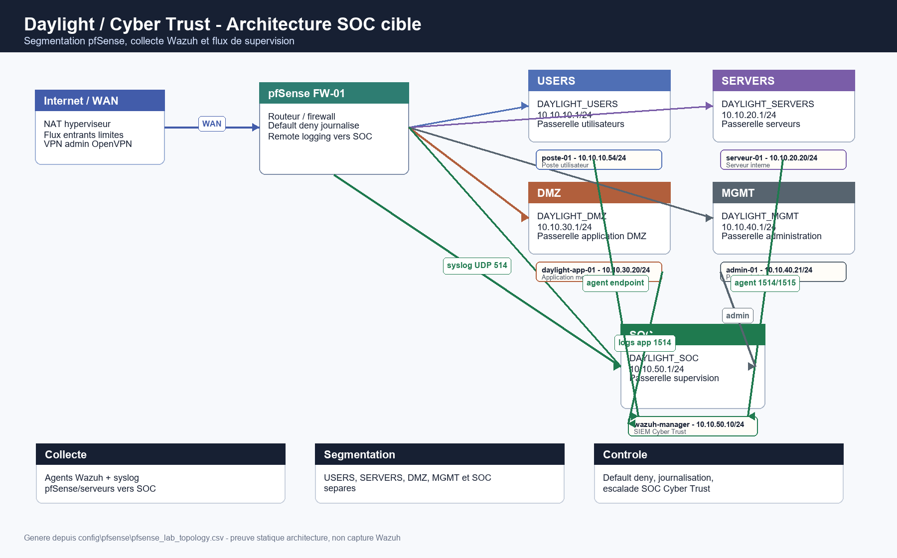
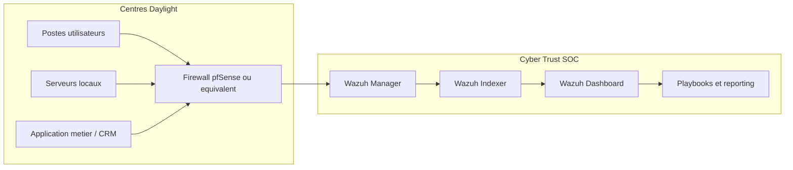
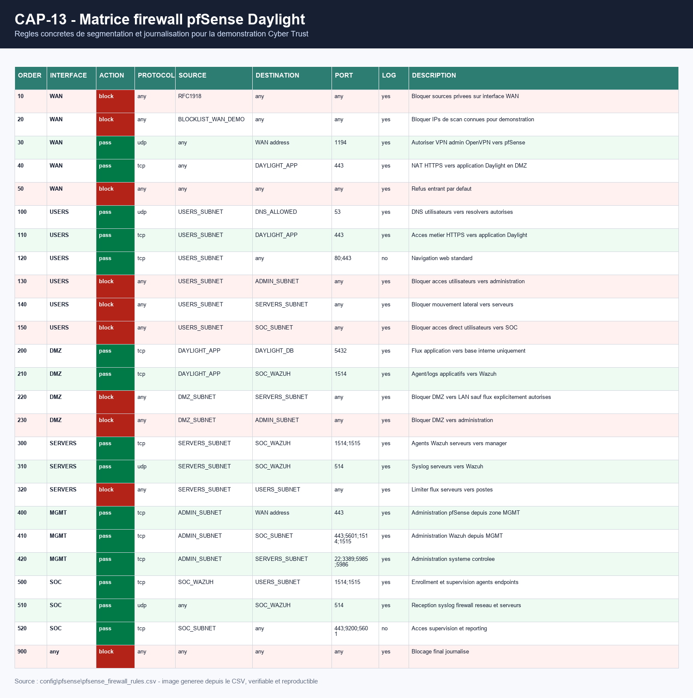
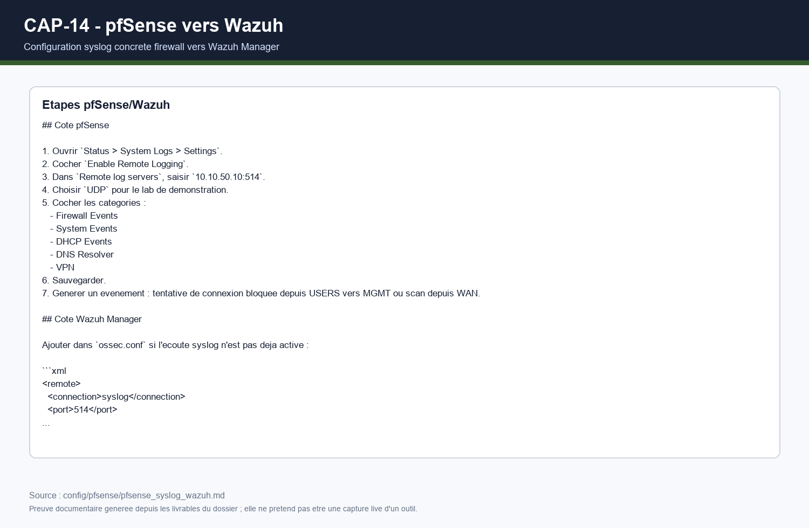
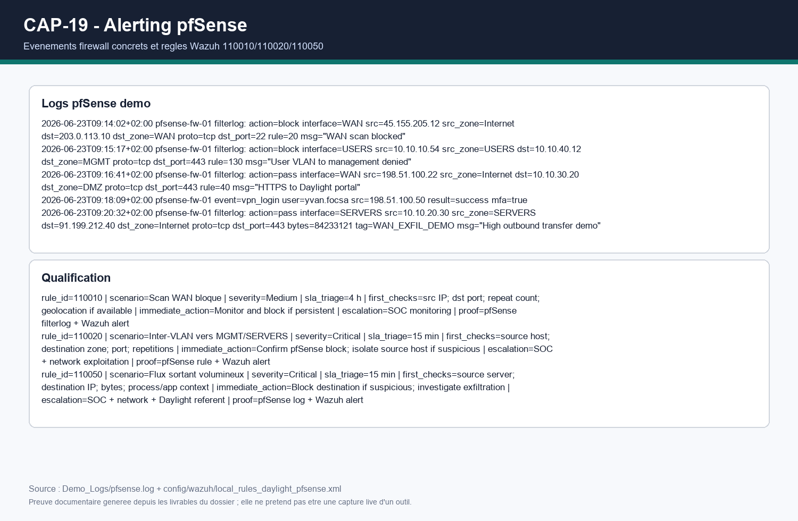

# Rendu individuel developpe - Yvan FOCSA

## Identification

| Champ | Valeur |
|---|---|
| Projet | Projet 4 - Mise en place d'un SOC externalise |
| Client fictif | Daylight, reseau de centres d'audioprothesistes |
| Prestataire | Cyber Trust |
| Membre | Yvan FOCSA |
| Role principal | Architecte de la solution, segmentation reseau, pfSense, coherence technique |
| Perimetre defendu | Architecture cible, architecture de demonstration, flux securises, firewall, integration SIEM, limites et trajectoire de production |

## Synthese personnelle

Mon role dans le projet est de transformer le besoin Daylight en architecture securite concrete. Le cahier des charges demande une solution demonstrable, mais aussi defendable devant un client : elle doit montrer comment Cyber Trust collecte les evenements, detecte les attaques, qualifie les alertes et fait evoluer le demonstrateur vers une solution industrialisable.

J'ai donc structure mon travail autour de quatre objectifs :

- proposer une architecture SOC lisible pour Daylight ;
- rendre la segmentation reseau concrete avec pfSense ;
- definir les flux autorises entre utilisateurs, serveurs, DMZ, management et SOC ;
- raccorder la vision reseau a Wazuh pour que les alertes ne soient pas seulement des concepts, mais des evenements exploitables.

La contribution principale n'est pas uniquement un schema. Elle comprend des fichiers de configuration, des matrices de flux, un mode operatoire pfSense/Wazuh, des preuves de demonstration et une explication claire des limites entre lab et production.

## Contexte Daylight et besoin d'architecture

Daylight est presente comme une entreprise multi-site, composee d'environ trente centres d'audioprothesistes. Son systeme d'information manipule des donnees sensibles : dossiers patients, rendez-vous, informations CRM, comptes utilisateurs, postes de travail, serveurs internes et flux applicatifs.

Le risque principal est double :

- les donnees patients sont sensibles et doivent etre surveillees ;
- les sites sont distribues, donc les evenements de securite peuvent etre disperses et difficiles a qualifier sans centralisation.

Cyber Trust intervient comme prestataire SOC externalise. L'architecture doit donc permettre a Daylight de conserver une vision simple cote client, tout en donnant a Cyber Trust les logs, les alertes et les preuves necessaires a l'investigation.

## Responsabilites exactes dans l'equipe

| Zone | Responsabilite Yvan | Collaboration |
|---|---|---|
| Architecture globale | Definir les composants, les flux, les zones reseau et la trajectoire cible | Tous |
| pfSense | Formaliser les interfaces, aliases, regles, NAT et syslog | Mahamadou pour l'exploitation du lab |
| Integration SIEM | Definir quels logs reseau doivent arriver dans Wazuh | Youssef pour les regles Wazuh |
| Demonstration | Preparer ce qui doit etre montre pour prouver l'architecture | Kilyan pour le deroule et les dashboards |
| Industrialisation | Expliquer comment passer du lab a une cible Daylight multi-site | Tous |

Mon perimetre ne remplace pas le travail SIEM de Youssef, ni la qualification pilotee par Kilyan, ni les playbooks de Mahamadou. Il sert a donner une base technique coherente a ces travaux.

## Architecture de demonstration

Le demonstrateur repose sur un socle volontairement simple afin d'etre montrable en soutenance :

- un Wazuh single-node pour la collecte, l'indexation et le dashboard ;
- un poste endpoint `poste-01` ;
- un serveur Linux simule `serveur-01` ;
- des logs applicatifs Daylight ;
- une logique pfSense documentee pour firewall, NAT, segmentation et syslog ;
- des dashboards et captures pour prouver les flux de securite.

L'objectif du lab n'est pas de simuler toute l'entreprise Daylight, mais de prouver les fonctions attendues :

1. collecter des logs de plusieurs sources ;
2. detecter des evenements critiques ;
3. afficher des alertes exploitables ;
4. qualifier les incidents ;
5. fournir une trajectoire d'industrialisation credible.

## Architecture cible proposee

La cible de production doit separer les roles techniques. En lab, Wazuh peut etre en single-node. En production, Cyber Trust doit separer les composants pour gerer la disponibilite, la volumetrie et la maintenance.

La cible recommande les principes suivants :

- un tunnel ou canal securise entre les sites Daylight et la plateforme SOC ;
- une collecte progressive par site, avec priorite aux actifs critiques ;
- des regles firewall journalisees pour les flux refuses importants ;
- des dashboards differents pour analystes, supervision Cyber Trust et client Daylight ;
- une retention definie selon les besoins d'audit, les contraintes RGPD et le budget ;
- une sauvegarde des configurations Wazuh, pfSense et dashboards ;
- un processus de changement pour les regles de detection et les regles firewall.

## Segmentation reseau concrete

La segmentation proposee repose sur cinq zones :

| Zone | Exemple | Role securite |
|---|---|---|
| USERS | `10.10.10.0/24` | Postes utilisateurs Daylight |
| SERVERS | `10.10.20.0/24` | Serveurs internes et services systeme |
| DMZ | `10.10.30.0/24` | Application exposee ou semi-exposee |
| MGMT | `10.10.40.0/24` | Administration technique |
| SOC | `10.10.50.0/24` | Wazuh, dashboards, collecte et supervision |

Cette separation limite le mouvement lateral. Par exemple, un poste utilisateur ne doit pas pouvoir contacter directement la zone d'administration ou la zone SOC. Un serveur peut envoyer ses logs vers Wazuh, mais il ne doit pas initier librement des connexions vers les postes utilisateurs.

## Regles pfSense livrables

Les regles firewall ne sont pas seulement decrites dans le rapport. Elles sont formalisees dans :

- `config/pfsense/pfsense_firewall_rules.csv`
- `config/pfsense/pfsense_aliases.csv`
- `config/pfsense/pfsense_nat_port_forward.csv`
- `config/pfsense/pfsense_lab_topology.csv`
- `config/pfsense/pfsense_syslog_wazuh.md`
- `config/pfsense/README_PFSENSE_DAYLIGHT.md`

Extrait des regles les plus importantes :

| Ordre | Interface | Action | Source | Destination | Port | Justification |
|---|---|---|---|---|---|---|
| 110 | USERS | pass | USERS_SUBNET | DAYLIGHT_APP | 443 | Acces metier HTTPS |
| 130 | USERS | block | USERS_SUBNET | ADMIN_SUBNET | any | Bloquer l'administration depuis les postes |
| 140 | USERS | block | USERS_SUBNET | SERVERS_SUBNET | any | Reduire le mouvement lateral |
| 150 | USERS | block | USERS_SUBNET | SOC_SUBNET | any | Proteger la plateforme SOC |
| 200 | DMZ | pass | DAYLIGHT_APP | DAYLIGHT_DB | 5432 | Flux applicatif vers base uniquement |
| 210 | DMZ | pass | DAYLIGHT_APP | SOC_WAZUH | 1514 | Remontee des logs vers Wazuh |
| 300 | SERVERS | pass | SERVERS_SUBNET | SOC_WAZUH | 1514/1515 | Agents Wazuh serveurs |
| 510 | SOC | pass | any | SOC_WAZUH | 514 | Reception syslog firewall et serveurs |
| 900 | any | block | any | any | any | Blocage final journalise |

## Aliases pfSense et logique de lisibilite

Pour que la configuration soit maintenable, les regles doivent utiliser des aliases plutot que des IP isolees. Les aliases rendent la politique lisible par un client et facilitent les changements.

Exemples d'aliases :

| Alias | Contenu logique | Utilite |
|---|---|---|
| USERS_SUBNET | Sous-reseau utilisateurs | Regles postes Daylight |
| SERVERS_SUBNET | Sous-reseau serveurs | Regles internes |
| DMZ_SUBNET | Zone application exposee | Isolation applicative |
| ADMIN_SUBNET | Zone management | Acces administration |
| SOC_WAZUH | Adresse Wazuh Manager | Collecte logs et agents |
| DAYLIGHT_APP | Application metier | Flux HTTPS utilisateurs |
| DAYLIGHT_DB | Base de donnees metier | Flux applicatif controle |

Ce choix permet d'expliquer la securite sans entrer dans une liste d'IP difficile a maintenir.

## NAT et exposition controlee

La seule exposition WAN retenue pour le demonstrateur est strictement controlee :

- VPN admin vers pfSense si necessaire ;
- HTTPS vers l'application Daylight en DMZ ;
- refus entrant par defaut ;
- journalisation des blocs importants.

En production, je recommande d'eviter l'administration directe depuis Internet. L'administration doit passer par VPN, MFA et zone MGMT. Les flux d'administration doivent etre separes des flux utilisateurs.

## Integration pfSense vers Wazuh

Le firewall a de la valeur pour le SOC seulement si ses logs sont centralises. Mon architecture prevoit l'envoi syslog pfSense vers Wazuh.

Mode operatoire resume :

1. dans pfSense, ouvrir `Status > System Logs > Settings` ;
2. activer `Remote Logging` ;
3. renseigner l'IP du Wazuh Manager ou du collecteur syslog ;
4. selectionner les logs firewall et systeme ;
5. verifier que le port UDP 514 est autorise vers `SOC_WAZUH` ;
6. generer un blocage firewall ;
7. verifier l'evenement dans Wazuh.

## Regles de detection reseau associees

La configuration Wazuh contient des regles specifiques pfSense :

| Regle | Niveau | Evenement | Objectif SOC |
|---|---:|---|---|
| `110010` | 8 | Trafic entrant bloque sur WAN | Detecter scan ou tentative externe |
| `110020` | 10 | Tentative de mouvement lateral inter-VLAN | Prioriser les flux internes interdits |
| `110030` | 6 | Connexion d'administration pfSense | Tracer les actions admin |
| `110040` | 7 | Connexion VPN admin | Surveiller les acces distants |
| `110050` | 11 | Flux sortant suspect volumineux | Suspicion d'exfiltration |

Ces regles relient mon perimetre architecture au perimetre SIEM de Youssef et au perimetre qualification de Kilyan.

## Scenarios de test architecture

| Test | Action | Resultat attendu | Preuve |
|---|---|---|---|
| T-ARCH-01 | Ouvrir le schema architecture | Les zones et flux sont lisibles | `CAP-12` |
| T-FW-01 | Afficher les regles pfSense | Les regles critiques existent et sont journalisees | `CAP-13` |
| T-FW-02 | Verifier remote syslog pfSense | pfSense envoie vers Wazuh | `CAP-14` |
| T-FW-03 | Simuler blocage inter-VLAN | Wazuh recoit une alerte `110020` | `CAP-24` |
| T-SOC-01 | Ouvrir dashboard firewall | Les evenements pfSense sont visibles | `CAP-19` |
| T-SOC-02 | Relancer le preflight | Le lab est coherent avant demo | `CAP-25` |

## Decision single-node en demonstration

Le choix du Wazuh single-node est coherent pour une soutenance :

- installation plus rapide ;
- moins de dependances ;
- demonstration plus facile a relancer ;
- reproductibilite meilleure sur un poste etudiant.

Mais je precise clairement que ce n'est pas une architecture de production. En production Daylight, il faudrait separer :

- Wazuh Manager ;
- Wazuh Indexer ;
- Wazuh Dashboard ;
- reverse proxy ou acces securise ;
- sauvegarde et supervision ;
- stockage adapte a la retention.

La soutenance doit donc presenter le single-node comme un MVP, pas comme la solution definitive.

## Dimensionnement cible

Pour Daylight, l'industrialisation doit commencer par un pilote. Je recommande :

| Phase | Perimetre | Objectif |
|---|---|---|
| Pilote | 2 a 3 centres | Valider agents, firewall, dashboards, playbooks |
| Extension | 10 centres | Stabiliser volumetrie, bruit d'alerte et SLA |
| Generalisation | 30 centres | Normaliser reporting, retention et support |
| Production mature | Tous sites + messagerie + AD | Couvrir le SI de maniere continue |

Les criteres a mesurer :

- nombre d'evenements par jour ;
- nombre d'alertes hautes et critiques ;
- taux de faux positifs ;
- temps de qualification ;
- delai d'escalade ;
- disponibilite dashboard ;
- cout de stockage.

## Risques d'architecture et mesures

| Risque | Impact | Mesure proposee |
|---|---|---|
| Trop de logs | Saturation stockage/indexation | Filtrage, retention, sizing progressif |
| Trop d'alertes | Fatigue analyste | Matrice de qualification et seuils |
| Flux admin mal separes | Compromission etendue | Zone MGMT, VPN, MFA, journalisation |
| pfSense non supervise | Perte de visibilite reseau | Syslog vers Wazuh et regles `110xxx` |
| Demonstration instable | Perte de temps video | Preflight, captures, dashboard offline |
| Donnees sensibles | Risque RGPD | Minimisation, preuves anonymisees, REX DPO |

## Livrables produits ou rattaches a mon perimetre

| Livrable | Role dans mon perimetre |
|---|---|
| `01_RAPPORT_TECHNIQUE_GROUPE.md` | Architecture generale et trajectoire cible |
| `18_SOLUTIONS_CONCRETES_DEMO.md` | Liste des elements montrables |
| `20_MODE_OPERATOIRE_PFSENSE_WAZUH_LAB.md` | Procedure pfSense/Wazuh |
| `config/pfsense/` | Regles, NAT, aliases et topologie |
| `config/wazuh/local_rules_daylight_pfsense.xml` | Regles firewall dans Wazuh |
| `Dashboards_Offline/daylight_pfsense_firewall_review.html` | Revue locale de la configuration firewall |
| `Annexes_Captures/CAP-12` a `CAP-14` | Preuves architecture et pfSense |
| `MANIFEST_DEPOT.md` | Controle d'integrite du rendu |

## Ce que je dois montrer pendant la video

Mon passage video doit etre court, concret et visuel :

1. ouvrir le schema architecture `CAP-12` ;
2. expliquer les zones USERS, SERVERS, DMZ, MGMT, SOC ;
3. ouvrir la matrice pfSense ou `CAP-13` ;
4. montrer que les regles bloquent le mouvement lateral ;
5. ouvrir la procedure syslog ou `CAP-14` ;
6. expliquer que les logs firewall remontent dans Wazuh ;
7. conclure sur la trajectoire production : pilote, extension, generalisation.

Texte court possible :

> Je suis Yvan FOCSA, architecte de la solution. Mon role est de rendre le SOC defendable techniquement : quelles zones reseau, quels flux, quelles regles firewall, quels logs vers Wazuh, et comment passer du lab a une cible Daylight multi-site.

## Limites assumees

Le dossier reste honnete sur plusieurs limites :

- le lab ne prouve pas une haute disponibilite ;
- les flux pfSense sont documentes et demonstrables, mais ne remplacent pas un audit complet d'un firewall de production ;
- la volumetrie reelle de trente sites n'est pas mesuree ;
- les logs metier sont simules pour la demonstration ;
- le lien video final reste a ajouter apres enregistrement.

Ces limites ne bloquent pas le projet, car le cahier des charges demande un MVP et une demonstration. Elles montrent surtout les actions a prevoir pour transformer le demonstrateur en service SOC operationnel.

## Apport personnel

Ce projet m'a fait passer d'une logique purement technique a une logique d'architecte. Une architecture ne se limite pas a un dessin : elle doit expliquer les choix, montrer les flux, prevoir les risques, donner des preuves et rester comprehensible pour un client.

J'ai appris a formuler une solution defendable :

- dire ce qui est fait ;
- dire ce qui est simule ;
- dire ce qui reste a industrialiser ;
- rattacher chaque choix a une preuve ou a un fichier.

## Conclusion individuelle

Ma partie apporte la colonne vertebrale technique du projet Cyber Trust. Elle explique comment Daylight peut segmenter son SI, proteger ses zones sensibles, envoyer les logs firewall vers Wazuh et construire progressivement une supervision SOC industrialisable.

Le resultat concret est un ensemble coherent : schema, matrice pfSense, mode operatoire, regles Wazuh, preuves de captures et trajectoire cible. Cette partie permet de montrer que le projet n'est pas seulement un SIEM installe, mais une solution de securite pensee comme un service client.
